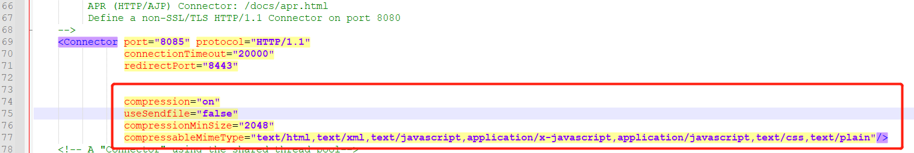

# demo

##  在线预览
### git subtree push --prefix=dist origin gh-pages

[在线预览](https://zhangxiang0316.github.io/vueUtils).

## gzip压缩

```
//引入该插件
const CompressionWebpackPlugin = require("compression-webpack-plugin")
//匹配此 {RegExp} 的资源
const productionGzipExtensions = /\.(js|css|json|txt|html|ico|svg)(\?.*)?$/i

const plugins = []
// start 生成 gzip 压缩文件
plugins.push(
new CompressionWebpackPlugin({
filename: "[path].gz[query]", //目标资源名称
algorithm: "gzip",
test: productionGzipExtensions, //处理所有匹配此 {RegExp} 的资源
threshold: 10240,//只处理比这个值大的资源。按字节计算(楼主设置10K以上进行压缩)
minRatio: 0.8 //只有压缩率比这个值小的资源才会被处理
})
);
 config.plugins = [...config.plugins, ...plugins];
```

## Tomcat 配置



```
 <Connector port="8085" protocol="HTTP/1.1"
               connectionTimeout="20000"
               redirectPort="8443" 
			   compression="on"   
			   useSendfile="false"
               compressionMinSize="2048"  
               compressableMimeType="text/html,text/xml,text/javascript,application/x-javascript,application/javascript,text/css,text/plain"/>
```

## nginx配置

```
server {
		listen 8081;
		server_name liangyuqing.cn;
		
		gzip on;
		gzip_min_length 1k;
		gzip_comp_level 6;
		gzip_types text/plain application/javascript application/x-javascript text/css application/xml text/javascript application/x-httpd-php image/jpeg image/gif image/png;
		gzip_vary on;
		gzip_disable "MSIE [1-6]\.";
```
